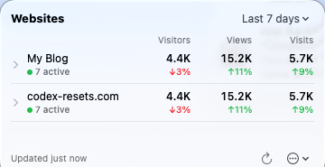

# UmamiBar

A native macOS menu bar app for viewing your Umami website analytics — live visitors, views and visits for all your websites in one scrolling list — without opening a browser.

<table>
  <tr>
    <td></td>
  </tr>
</table>

## Build & run

Requires Xcode with Swift 6 / macOS 14+.

```sh
make run        # builds and launches build/UmamiBar.app
make build      # just build the .app bundle
make clean
```

## Configuration

Open Settings (gear icon in the popover, or Cmd+,).

### Umami Cloud

1. Go to [cloud.umami.is](https://cloud.umami.is) → Settings → API keys and create a key.
2. In UmamiBar settings choose "Umami Cloud" and paste the API key. Endpoint is `https://api.umami.is/v1` (US/EU region selectable).

### Self-hosted

Choose "Self-hosted", then enter your server URL (e.g. `https://analytics.example.com`), username and password.

Credentials are stored in the macOS Keychain.
